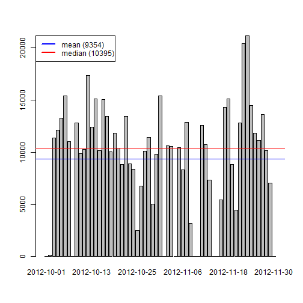
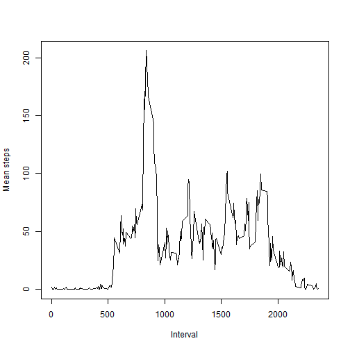
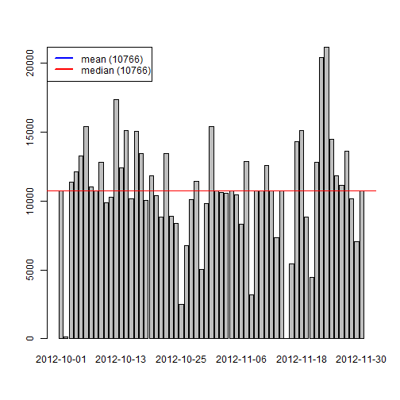
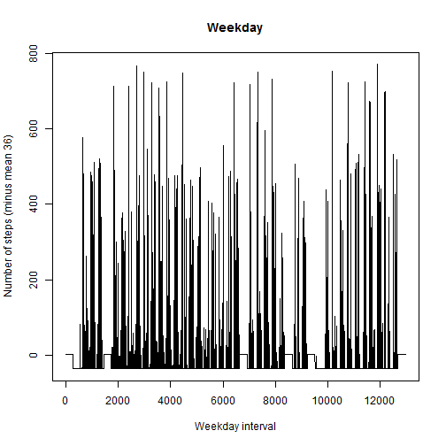
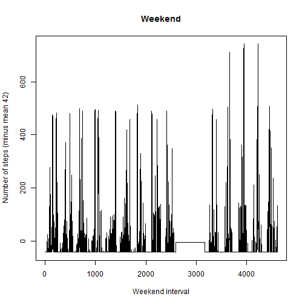

# Reproducible Research: Peer Assessment 1


## Loading and preprocessing the data

```r
substrLast4 <- function(x){
  substr(x, nchar(x)-3, nchar(x))
}

# Load the data (i.e. read.csv())
file <- "activity.zip"
data <- read.csv(unz(file, "activity.csv"), header=TRUE, sep=",")

# Process/transform the data (if necessary) into a format suitable for your analysis
data$date <- as.Date(data$date, "%Y-%m-%d")
tmp <- paste("000",data$interval, sep="")
time <- lapply(tmp, substrLast4)
data$time <- as.POSIXct(paste(data$date, time), format="%Y-%m-%d %H%M")
```

## What is mean total number of steps taken per day?

```r
# Make a histogram of the total number of steps taken each day
sum_aggr = aggregate(data$steps, by=list(Category=data$date), FUN=sum, na.rm = TRUE)
barplot(sum_aggr$x, names.arg=sum_aggr$Category)

# Calculate and report the mean and median total number of steps taken per day
mean_steps <- mean(sum_aggr$x)
median_steps <- median(sum_aggr$x)

mean_array <- rep(mean_steps, length(sum_aggr$Category))
median_array <- rep(median_steps, length(sum_aggr$Category))

abline(lm(mean_array~sum_aggr$Category),col="blue")
abline(lm(median_array~sum_aggr$Category),col="red")
legend("topleft", lwd = 2, col = c("blue", "red"), 
       legend = c(paste("mean (", round(mean_steps), ")", sep=""), 
                  paste("median (", round(median_steps), ")", sep="")))
```

 

## What is the average daily activity pattern?

```r
# Make a time series plot (i.e. type = "l") of the 5-minute interval (x-axis) and the average number of steps taken, averaged across all days (y-axis)
min5_mean <- mean(data$steps, na.rm = TRUE)
min5_mean
```

```
## [1] 37.38
```

```r
plot(data$time, data$steps-min5_mean, type="l", 
     xlab = 'Date', 
     ylab = paste('Number of steps (minus mean ', round(min5_mean), ')'))
```

 

```r
# Which 5-minute interval, on average across all the days in the dataset, contains the maximum number of steps?
data$steps[is.na(data$steps)] <- -1
data[data$steps==max(data$steps, na.rm = TRUE) ,]
```

```
##       steps       date interval                time
## 16492   806 2012-11-27      615 2012-11-27 06:15:00
```

```r
data$steps[data$steps==-1] <- NA
```

## Imputing missing values

```r
# Calculate and report the total number of missing values in the dataset (i.e. the total number of rows with NAs)
length(data$steps[is.na(data$steps)])
```

```
## [1] 2304
```

```r
# Devise a strategy for filling in all of the missing values in the dataset. The strategy does not need to be sophisticated. For example, you could use the mean/median for that day, or the mean for that 5-minute interval, etc.
# The strategy is to use the mean steps for the existing ones: 
dafault_step <- mean(data$steps, na.rm = TRUE)

# Create a new dataset that is equal to the original dataset but with the missing data filled in.
filled_data <- data
filled_data$steps[is.na(filled_data$steps)] <- dafault_step

# Make a histogram of the total number of steps taken each day and Calculate and report the mean and median total number of steps taken per day. Do these values differ from the estimates from the first part of the assignment? What is the impact of imputing missing data on the estimates of the total daily number of steps?
sum_aggr = aggregate(filled_data$steps, by=list(Category=filled_data$date), FUN=sum)
barplot(sum_aggr$x, names.arg=sum_aggr$Category)

mean_steps <- mean(sum_aggr$x)
median_steps <- median(sum_aggr$x)

mean_array <- rep(mean_steps, length(sum_aggr$Category))
median_array <- rep(median_steps, length(sum_aggr$Category))

abline(lm(mean_array~sum_aggr$Category),col="blue")
abline(lm(median_array~sum_aggr$Category),col="red")
legend("topleft", lwd = 2, col = c("blue", "red"), 
       legend = c(paste("mean (", round(mean_steps), ")", sep=""), 
                  paste("median (", round(median_steps), ")", sep="")))
```

 

The impact in this case is that instead of handling the NA as ignored they are in this case replaced by the mean value of the other steps. The result is that the mean and median have increased. What is wrong and right depends on if the missing values should be handles as no steps (last plot) or missed steps (this plot).  

## Are there differences in activity patterns between weekdays and weekends?

```r
# Create a new factor variable in the dataset with two levels - "weekday" and "weekend" indicating whether a given date is a weekday or weekend day.
sunday <- as.POSIXlt(filled_data$date)$wday==0
saturday <- as.POSIXlt(filled_data$date)$wday==6
filled_data$weekday <- factor(sunday | saturday, labels = c("weekday", "weekend"))

# Make a panel plot containing a time series plot (i.e. type = "l") of the 5-minute interval (x-axis) and the average number of steps taken, averaged across all weekday days or weekend days (y-axis). The plot should look something like the following, which was creating using simulated data:
weekday_data = filled_data[filled_data$weekday=="weekday",]
weekend_data = filled_data[filled_data$weekday=="weekend",]

mean_weekday_steps <- mean(weekday_data$step)
mean_weekend_steps <- mean(weekend_data$step)

plot(weekday_data$step-mean_weekday_steps, type="l", 
     xlab = 'Weekday interval', 
     ylab = paste('Number of steps (minus mean ', round(mean_weekday_steps), ')', sep=""),
     main = 'Weekday')
```

 

```r
plot(weekend_data$step-mean_weekend_steps, type="l", 
     xlab = 'Weekend interval', 
     ylab = paste('Number of steps (minus mean ', round(mean_weekend_steps), ')', sep=""),
     main = 'Weekend')
```

 

There are different activity pattern. Mean number if steps are bigger on weekends than weekdays, but there are more higher step intervals on weekdays than on weekends.
